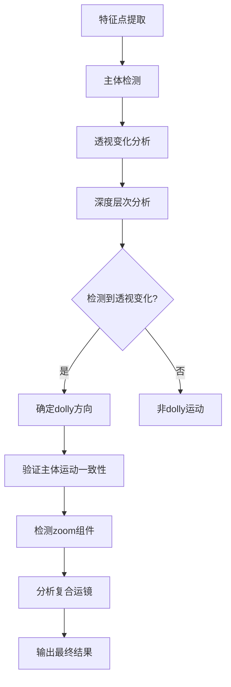

# Dolly运镜检测功能

## 功能概述

本模块在原有相机运动检测基础上，新增了**Dolly运镜检测**功能，能够识别以下运镜类型：

- **Dolly In**: 相机向前移动，主体逐渐靠近
- **Dolly Out**: 相机向后移动，主体逐渐远离  
- **复合运镜**: 如 `dolly_in_zoom_out` (著名的希区柯克变焦效果)

## Dolly vs Zoom 的区别

| 特性 | Dolly运镜 | Zoom缩放 |
|------|-----------|----------|
| **相机位置** | 相机前后移动 | 相机位置固定 |
| **镜头焦距** | 焦距保持不变 | 改变镜头焦距 |
| **透视关系** | 背景透视发生变化 | 透视关系保持不变 |
| **主体大小** | 主体和背景同比例变化 | 只有整体画面缩放 |
| **景深效果** | 前景/背景相对位置改变 | 所有物体等比例缩放 |

## 检测原理

### 1. 主体检测
```python
def detect_subject(self, pred_tracks, pred_visibility, frame_idx=0):
    """
    基于特征点密度和中心位置识别画面主体
    - 优先检测中心区域的特征点
    - 使用KD树分析特征点密度
    - 计算主体边界框和中心坐标
    """
```

### 2. 透视变化分析
```python
def analyze_perspective_change(self, pred_tracks, stable_point_ids):
    """
    分析透视变化（dolly运动的关键特征）
    - 将特征点按距离分层：近景、中景、远景
    - 分析径向运动模式
    - 检测dolly运动的典型模式
    """
```

### 3. 复合运镜检测
```python
def detect_dolly_zoom_combination(self, pred_tracks, pred_visibility, stable_point_ids):
    """
    检测dolly和zoom的复合运镜
    - dolly_in_zoom_out: 希区柯克变焦效果
    - dolly_out_zoom_in: 反向希区柯克效果
    - dolly_in_zoom_in: 强化接近效果
    - dolly_out_zoom_out: 强化远离效果
    """
```

## 检测流程图



## 使用方法

### 基本使用
```python
from vbench2.camera_motion import CameraPredict

# 创建预测器
device = "cuda"
submodules_dict = {
    "repo": "facebookresearch/co-tracker",
    "model": "cotracker2_online"
}
camera = CameraPredict(device, submodules_dict)

# 分析视频
results = camera.predict(video, fps, end_frame)
print(f"检测到的运动类型: {results}")

# 可能的输出：
# ['dolly_in']
# ['dolly_out'] 
# ['dolly_in_zoom_out']
# ['dolly_zoom_effect']
```

### 详细分析
```python
# 获取轨迹数据
pred_tracks, pred_visibility = camera.infer(video)
stable_point_ids = camera.find_stable_feature_points(pred_visibility)

# 单独分析dolly运动
dolly_result = camera.analyze_dolly_motion(pred_tracks, pred_visibility, stable_point_ids)

# 分析复合运镜
combination_result = camera.detect_dolly_zoom_combination(
    pred_tracks, pred_visibility, stable_point_ids)

print(f"Dolly类型: {dolly_result['type']}")
print(f"置信度: {dolly_result['confidence']}")
print(f"复合运镜: {combination_result['type']}")
```

### 测试功能
```python
from vbench2.camera_motion import test_dolly_motion_detection

# 专门测试dolly运动检测
test_dolly_motion_detection(
    video_path="your_video.mp4",
    output_dir="./dolly_test_results",
    device="cuda",
    stability_threshold=0.8
)
```

## 输出类型说明

### 基础运镜类型
- `dolly_in`: 相机向前移动，主体靠近
- `dolly_out`: 相机向后移动，主体远离

### 复合运镜类型  
- `dolly_in_zoom_out`: 希区柯克变焦效果（前推后拉）
- `dolly_out_zoom_in`: 反向希区柯克效果
- `dolly_in_zoom_in`: 双重接近效果
- `dolly_out_zoom_out`: 双重远离效果
- `dolly_zoom_effect`: 一般dolly+zoom组合

## 特殊情况处理

### Dolly In + Zoom Out
这是最具挑战性的检测场景：
- **问题**: 主体大小变化可能不明显
- **解决**: 重点分析透视变化和背景运动模式
- **关键指标**: 近景特征点向外扩散，远景特征点相对静止

### 低置信度情况
当检测置信度较低时：
- 设置置信度阈值（默认0.3）
- 结合其他运动分析进行验证
- 保留原有检测方法作为后备

## 技术参数

### 阈值设置
```python
motion_threshold = min(width, height) * 0.01      # 运动检测阈值
edge_threshold = min(width, height) * 0.15        # 边缘区域阈值
confidence_threshold = 0.3                        # 置信度阈值
stability_threshold = 0.8                         # 特征点稳定性阈值
```

### 深度层次划分
- **近景**: 距离中心最近的33%特征点
- **中景**: 中间33%特征点  
- **远景**: 距离中心最远的33%特征点

## 评测集成

该功能已集成到VBench的camera motion评测中：

```python
def compute_camera_motion(json_dir, device, submodules_dict, **kwargs):
    camera = CameraPredict(device, submodules_dict)
    # 自动包含dolly运动检测
    all_results, video_results = camera_motion(prompt_dict_ls, camera)
    return all_results, video_results
```

## 注意事项

1. **依赖scipy**: 主体检测需要scipy.spatial模块
2. **计算复杂度**: dolly检测增加了额外的计算开销
3. **准确性**: 复合运镜检测的准确性可能较单一运动低
4. **适用场景**: 最适合有明显前景主体的场景

## 示例输出

```bash
=== Dolly运动检测测试 ===
主体检测结果:
  主体特征点数: 15
  主体中心: [640.2 360.8]
  主体边界框: [580.1, 320.4, 700.3, 401.2]

透视变化分析:
  检测到dolly模式: True
  Dolly方向: dolly_in
  置信度: 0.742
  近景运动: 12.3
  中景运动: 8.1
  远景运动: 2.4

Dolly+Zoom复合运镜分析:
  复合运镜类型: dolly_in_zoom_out
  整体置信度: 0.672
  Dolly组件: dolly_in
  Zoom组件: zoom_out

=== 最终运动分类结果（包含Dolly检测）===
检测到的所有相机运动类型: ['dolly_in_zoom_out', 'dolly_zoom_effect']
``` 